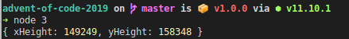

I'm busy, but in my spare time when I'm not engineering at work, I'm engineering at home. Recently, I've hit a dry streak with stuff to do. I've already written [1](https://github.com/hjfitz/relay.ts), [2](https://github.com/hjfitz/yanc-webserver) clones of Express and I can't take it anymore. That's why I'm thankful for [Avent of Code](https://adventofcode.com/).

Whenever there's been some downtime, I've tackled it. [Day 3](https://adventofcode.com/2019/day/3) was difficult and actually a nice challenge, so I thought I'd take you, the reader, along for the ride. It took a few attempts to actually solve. I went in without proper planning and at it's height, my solution consumed **112GB** of memory.

This is a journey of learning how to better utilise memory in a Node.js program. I could have opted for something like Go, but honestly I've never attempted something like Day 3 and overall feel more comfortable in Node. There's also some nice features that I use here.

# The Problem
I'll cut it short as the website has a bunch of (fun) fluff around the problem. In effect, you're given two sets of wire 'paths' and must find where they intersect. You then answer with the shortest [Manhattan Distance](https://en.wikipedia.org/wiki/Taxicab_geometry) from the origin to intersection.

Your input dataset consists of two wire-paths. The input may look like:
```
R8,U5,L5,D3
U7,R6,D4,L4
```

As an example, the top line states that the wire goes Right by 8 units, Up by 5, Left by 5 and Down by 3. Drawn out, this looks like:
```
...........
.+-----+...
.|.....|...
.|..+--X-+.
.|..|..|.|.
.|.-X--+.|.
.|..|....|.
.|.......|.
.o-------+.
...........
```

Seems simple, right? Turns out, it's a challenge - and a fun one at that. Let's get started!


# A Few Solutions...

Every one of my days have worked in the same way:
1. Read the data in
2. Parse it
3. ~~draw the rest of the fucking owl~~ Solve it

## Read the Data
This never changed. Store the data in a file and `fs.readFileSync()` it. 
When I'm working with test and 'prod' data, I'll leave two filename declarations in and uncomment/comment one out for testing. The final dataset for day 3 is huge. My initial attempt went from 10s of minutes to a few seconds. The addition of the testfile was pretty necessary here, if just for a sanity check.

```js
const filename = './3/final'
// const filename = './3/test-dataset-1'
const [wire1, wire2] = fs.readFileSync(filename).toString().split('\n')
```

## Parsing it
Here was my thought process: Create a 2D array, populate that matrix with dots and draw on the diagrams. Simple, right? This happens in `defineGrid()`.

```js
let xHeight = yHeight = 0

function getMax(...sets) {
    return Math.max(sets.flat().map(dir => dir.replace(/[a-z]/i, '')).map(num => parseInt(num, 10)))
}

function defineGrid(coords) {
    // sum up all left, right, up, down and find the max u/d and l/r
    const up = coords.filter(dir => dir.indexOf('U') === 0)
    const down = coords.filter(dir => dir.indexOf('D') === 0)
    const left = coords.filter(dir => dir.indexOf('L') === 0)
    const right = coords.filter(dir => dir.indexOf('R') === 0)


    yHeight = getMax(up, down)
    xHeight = getMax(left, right)

    const grid = new Array(yHeight)
    for (let y = 0; y < yHeight + 1; y++) {
        grid[y] = new Array(xHeight)
        for (let x = 0; x < xHeight + 1; x++) {
            grid[y][x] = '.'
        }
	} 
}
```

`defineGrid()` works in the following way:
1. Split all directions in to their own array
2. Find the largest number in on the x and y axis
3. Populate a 2D array of dots (`.`) per the max x and y figures.

The issue lies in 2). We could go up, left and up again. The sum of those 'up's could be more than the max x value! The program threw an error. A quick change of `getMax()` solves this: Sum up all of the figures in the array:
```js
function getMax(...sets) {
    return sets.flat().map(dir => dir.replace(/[a-z]/i, '')).reduce((acc, cur) => acc + cur, 0)
}
```

**Note:** By setting the initial value of the accumulator (`acc`) in the reduce piece, all of our values for current (`cur`) are coerced to Numbers.


## The Solution
The solution was likely how you'd think it. Display the wires like they are on the site and find the `X`s. To do this I loop through `[wire1, wire2]` and draw their diagrams. Earlier, I parsed a map for the diagram:
```js
for (let x = 0; x < xHeight + 1; x++) {
	grid[y][x] = '.'
}
```

So, I follow the 'instructions' for each wire diagram, replacing a `.` with a `|` or `-` dependent on where we're moving. Again, if grid[x][y] isn't a `.`, draw an `X`. The lines are there to help with a visualiser, which I've yet to implement. 

Let's look at how I draw the wire diagram. It's split in to four phases; let's decompose it:


### 1. Define a Cursor
This is pretty straightforward:
```js
const cursor = {x: xHeight, y: 0}
```

### 2 .Split and Iterate
Again, straightforward:
```js
for (const coord of wire.split(',')) {
	// left as an exercise to the reader :^)
}
```

### 3. Decompose the Instruction
A little less straightforward...
```js
const [dir, ...nums] = coord.split('')
const paces = parseInt(nums.join(''), 10)
```

### 4. Move and draw!
Somewhat straightforward, but a mess.
```js
function moveAndDraw(cursor, dir, symbol, amt) {
	cursor[dir] += amt
	grid[cursor.y][cursor.x] === '.' ? symbol : 'X'
}

switch (dir) {
	case 'U': {
		for (let y = 1; y < num; y++)
			moveAndDraw(cursor, 'y', '|', -1)	
		moveAndDraw(cursor, 'y', '+', -1)
	}
	case 'D': {
		for (let y = 1; y < num; y++)
			moveAndDraw(cursor, 'y', '|', 1)	
		moveAndDraw(cursor, 'y', '+', 1)
	}
	case 'L': {
		for (let y = 1; y < num; y++)
			moveAndDraw(cursor, 'x', '-', -1)	
		moveAndDraw(cursor, 'x', '+', -1)
	}
	case 'R': {
		for (let y = 1; y < num; y++)
			moveAndDraw(cursor, 'x', '-', 1)	
		moveAndDraw(cursor, 'x', '+', 1)
	}
}
```

`moveAndDraw()` Does what it says on the tin. Move a `cursor` in a `direction` and draw a `symbol`. Move this cursor by a given `amount`. Any input on the `case` would be appreciated - it's a mess!

## Memory Issues
Before we discuss calculating the Manhattan Distance, I've to to chat about some memory issues. As it turns out, this way *works*, but it's pretty lazy when it comes to memory. Let's go back to grid creation...
```js
for (let y = 0; y < yHeight + 1; y++) {
        grid[y] = new Array(xHeight)
        for (let x = 0; x < xHeight + 1; x++) {
            grid[y][x] = '.'
        }
	} 
```

This doesn't look so bad. Initialise a 2D array of dots. Let's look at the final values for `xHeight` and `yHeight`...



That's 23,633,280,652 elements in the array. We can get the size of a `.` in node using `Buffer`:
```js
Buffer.from('.').length
// 1
```

Already we can see that this is at least going to be 23GB, not to mention when we start working on that array...

```
FATAL ERROR: Ineffective mark-compacts near heap limit Allocation failed - JavaScript heap out of memory
```

### Memory Improvement
The point of the array of dots was to implement a visualiser. If we did away with that, we'd save significantly on memory. Easily, we can just spin up our original Y array, and populate the X columns when necessary.

The program should start using only 150,000 spaces in the array, or 150KB! Obviously, this comes with issues. More validation when checking... Does `grid[y][x]` actually exist before we compare? But we can code for that.

We can also use the [`delete` keyword](https://developer.mozilla.org/en-US/docs/Web/JavaScript/Reference/Operators/delete) in JavaScript - remove a variable. According to MDN:

>The JavaScript delete operator removes a property from an object; if no more references to the same property are held, it is eventually released automatically

Because top-level variables belong to `global` (node) or `window` (browser), they can be deleted too!

We can bin off a few things here. Let's delete the original wires, because they're not used anymore. Let's also delete the grid once we've added stuff to it and found our intersections.

```js
delete wire1
delete wire2

// working code goes here

delete grid

// figure out the manhattan distance
```

Of course, we can remove other stuff - but I won't bore you with it all.

Another thing we could look at is dynamically extending the array when necessary. When we traverse, we could add a check for the new location and if the array isn't long enough, extend it. I never actually implemented this, but we can look at it might work. If we take `modeAndDraw()` for example:

```js
function moveAndDraw(cursor, dir, symbol, amt) {
	cursor[dir] += amt
	grid[cursor.y][cursor.x] === '.' ? symbol : 'X'
}
```

The program just adds the symbol because we're confident that the array is that long. By dynamically allocating the array, we could do something like:
```js
function moveAndDraw(cursor, dir, symbol, amt) {
	cursor[dir] += amt
	if (!grid[cursor.y]) grid[cursor.y] = new Array(cursor.x)
	grid[cursor.y][cursor.x] === '.' ? symbol : 'X'
}
```

This is a little off-the-top-of-my-head, but it *should* work...

I know this was a little over-hyped on the memory management side of things, but it's a nice reminder that the computers we have still have limiatations - as well as the engineers behind them!

## The Manhattan Distance
A quick primer on the manhattan distance before I explain how I worked this out. A quick tl;dr is:
> The sum of all vertical and horizontal movement from Point A to Point B

For example, the manhattan distance below is 7. We move up 4 and across 3:
```
......
.+--B.
.|....
.|....
.|....
.A....
......
```

### My Solution
Again, this is a simple one - but likely doesn't scale well. All we need to do is find where each intersection is and calculate the relevant manhattan distance. From that, pull out the smallest distance!

#### Find Every Intersection
Just loop `x/y` through the grid and save that to a results list.

```js
const results = {
    o: {},
    x: [],
}

console.log("> Beginning traverse")
for (let y = 0; y < grid.length; y++) {
    if (grid[y] !== undefined) {
        for (let x = 0; x < grid[y].length; x++) {
            if (grid[y][x] === 'X') results.x.push({y, x})
            if (grid[y][x] === 'o') results.o = {y,x}
        }
    }
}
```

#### Calculate the Manhattan Distance
Here, I mix some funtional programming with procedural stuff. Purists hate me.

The program maps over `results.x` (poor naming, I know) and finds the distance - `dy/dx`.

```js
const distances = results.x.map(crd => (results.o.x - crd.x) + (results.o.y - crd.y))
```

#### Find The Smallest Distance
We could abuse JavaScript and do this in a few ways. I used `Math.min()`. I'll put a few below
```js
const min = Math.min(...distances)
const [smallest] = distances.sort()
const minimal = distances.sort().shift()
```

# Wrap-Up
To conclude, this was a pretty fun project. It reminded me that memory was something to consider even if I don't use a language that gives me direct access to it.

I've put the [code on GitHub](https://github.com/hjfitz/advent-of-code-2019/tree/master/3) for your browsing pleasure. Note that I've taken this post as an opportunity to refactor it. It's still a mess on GitHub.