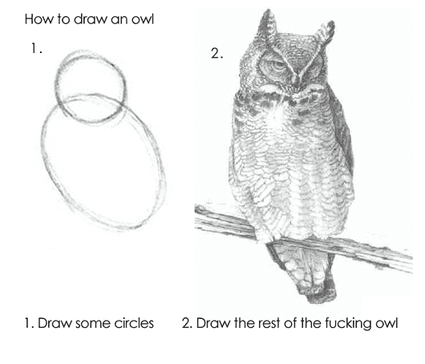
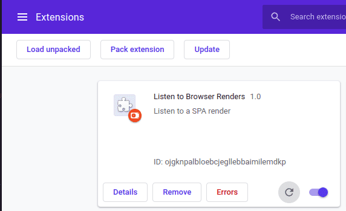
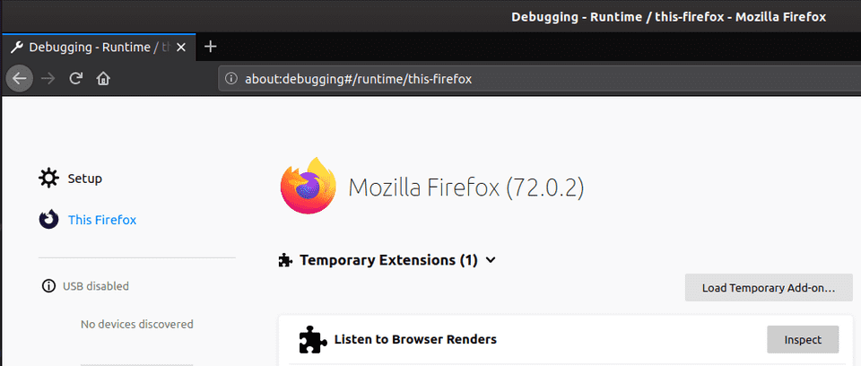

I saw an awesome [Gist](https://gist.github.com/tomhicks/6cb5e827723c4eaef638bf9f7686d2d8) called `plink-plonk.js` the other day. It shows you how you can, for single page apps, listen to how a page changes and re-renders.

The code’s pretty simple too:

```jsx
const audioCtx = new (window.AudioContext || window.webkitAudioContext)()
const observer = new MutationObserver(function(mutationsList) {
  const oscillator = audioCtx.createOscillator()

  oscillator.connect(audioCtx.destination)
  oscillator.type = "sine"
  oscillator.frequency.setValueAtTime(
    Math.log(mutationsList.length + 5) * 880,
    audioCtx.currentTime,
  )

  oscillator.start()
  oscillator.stop(audioCtx.currentTime + 0.01)
})

observer.observe(document, {
  attributes: true,
  childList: true,
  subtree: true,
  characterData: true,
})
```

Create an audio context and observer, and observe the document. For each change, oscillate.



It got me thinking, how do we execute our own JavaScript on other websites? Web Extensions.

# Web Extensions API

The [Web Extensions API](https://developer.mozilla.org/en-US/docs/Mozilla/Add-ons/WebExtensions) allows us to write custom JavaScript to run on any site, to enhance the experience.

Now that this is a standard API for browsers, it’s easy enough to write a basic extension. Let’s start with folder structure:

```jsx
dist/ 
  - manifest.json 
  - extension.js
```

- **dist:** Where our final extension lies
    - **manifest.json:** Metadata about our web extension
    - **extension.js:** The core code for our extension. If we wanted, we could split this out in to different files in a `src/` directory and use webpack to bundle it. I’ve done this [here](https://github.com/hjfitz/WEBRES-1)
    - As an aside, this is a pretty cool extension

## Extension Manifest

Let’s talk about the [manifest](https://developer.mozilla.org/en-US/docs/Mozilla/Add-ons/WebExtensions/manifest.json). This defines how our application works.

For our purposes, we just want to inject the aforementioned `plink-plonk.js` to any page. Let’s look at our manifest.json:

```json
{
	"name": "Listen to Browser Renders",
	"version": "1.0",
	"description": "Listen to a SPA render",
	"permissions": ["activeTab"],
	"content_scripts": [
		{
			"matches": ["<all_urls>"],
			"run_at": "document_end",
			"js": ["ext.js"]
		}
	],
	"manifest_version": 2
}
```

There’s a lot of stuff here that speaks for itself. We’re interested in demystifying `permissions`, `content_scripts` and `manifest_version`.

- **permissions:** Which [permissions](https://developer.mozilla.org/en-US/docs/Mozilla/Add-ons/WebExtensions/manifest.json/permissions) does the extension want to ask for. Here, we just want to use the
active tab. You can ask for a lot more too. There are some interesting
permissions, so check these over when you install a new extension… A few of note are:
    - downloads
    - browsingData
    - topSites
    - cookies
- **content_scripts:** These are scripts that run on the `matches` key.
    - **matches:** Which URL to run on. We want all, so `<all_urls>` hits this.
    - **run_at:** When to run the script. I’ve gone for `document_end`. This is the same as wrapping your code in `$(document).ready()` or just firing it when `DOMContentLoaded` is fired.
    - **js:** Which JavaScript file to execute.
- **manifest_version:** The version of the Web Extension manifest to follow. Not sure why we don’t us the standard `$schema` key here.

# The Code

Honestly, there’s not a lot to say here. I just took `plink-plonk.js` and shoved it in to `ext.js` that I refer to in the manifest file.

# Loading the Extension

To install this manually, go to extensions and you should get the option to load it.

In Chrome: Make sure developer mode is on; hit `load unpacked extension` at the top left, navigate to the folder that your extension sits in and load it.



In Firefox: Go to `about:debugging` and hit `Load temporary extension`. Navigate to your manifest file and load that.



# Thoughts

This is a pretty cool thing to listen to how a page changes. The more noise really does equate to how noisy your page is on load. The less noise might mean a better user experience (on load) as there’s less jumping about.

The Observer API doesn’t seem to work too well on Firefox though, there’s less audio generated.
