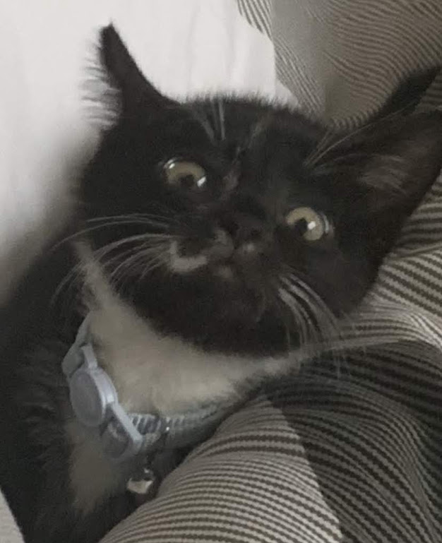

I'm [hjf](https://www.linkedin.com/in/harry-fitzgerald/). This is a little blog that I run on GitHub pages with Gatsby. It's mostly a learning project - but mostly because I wanted another project.

Currently, I'm a Cloud Engineer at Elanco leading our Azue Security implementation, mentoring placement students and helping implement IAM while they split from Eli Lilly. Speaking of, I used to work for, Eli Lilly, as a Full Stack Div Slinger. Oddly enough, I'm still with the same team.

I work with a lot ot TypeScript, JavaScript, Preact/React and I dabble in Go.

The kind of project I like, currently, is copying a big concept - but creating a tiny codebase for it. I'm working on my second iteration of an Express.js clone currently. 

Recently, I've built:
* [A tiny event emitter](https://github.com/hjfitz/mitr)
* [A Spotify player for the CLI](https://github.com/hjfitz/spoticli)
* [An alternative to optoinal object chaining](https://github.com/hjfitz/hitcher)
* [A way to manipulate images in the DOM](https://github.com/hjfitz/js-images)
* [one](https://github.com/hjfitz/relay.ts), [two](https://github.com/hjfitz/mtws) clones of Express

There's a lot more - but peer through the source code yourself! I'm [hjfitz on GitHub](https://github.com/hjfitz?tab=repositories).

This is a blog - it should go without saying that these are my own opinions.

Also -- I've got a cat. He's Zuko. Isn't he a cutie?

