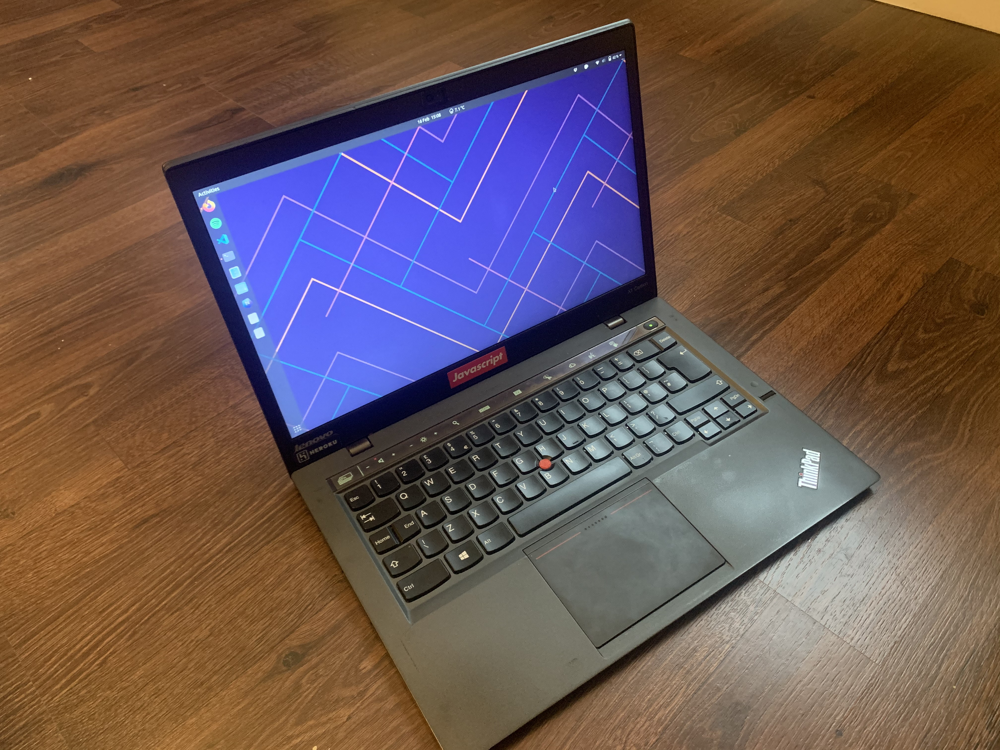

I always find it interesting to see what other people use. I'm a bit of a gear freak. EDC, VEDC, I love it all. I guess this is... DEDC - Digital Every Day Carry.

# Hardware

I'll start outside of the digital world, and work my way down. I'll aim to add pictures as and when I get opportunities.

## Desk Setup - Home

This is about as far out as DEDC reaches. For home, I've got the 'default' IKEA desk in black. [You know the one](https://www.ikea.com/gb/en/p/linnmon-adils-table-black-brown-black-s39932562/). This sits a 27-inch Samsung S27B970D. It's glorious, but a bit too reflective. You also need to use DisplayPort to view it in 1600p - which I lack.

I've also got a Filco Majestouch 2 TKL with some custom keycaps and a Steelseries Sensei. That's all; I don't like clutter.

I'd like another monitor though.

## Desk Setup - Work

I'm not sure which default corporate desk I've got - but you can probably imagine the kind. A large slab with a (necessary) divider and light wooden veneer. 

This sits two Dell U2719Ds. These are awesome, and are at the top of a monitor stand, angled down. Because I slouch like every good developer. My back sits basically on the seat of the work Herman Miller Aeron.

## Laptop - Home

For personal development, I use a Lenovo Thinkpad - a second gen X1 Carbon. It's great, and I love the keyboard to bits. Things like the 'touch bar' are questionable - but there's USB, HDMI and it's damn light. It's got a pretty good spec:

* 2.1 Quad-Core Intel i7-4600u
* 1600x900 Display
* 8GB Memory
* 240GB SSD

I run Ubuntu on it - but I've been known to change this up a bit. I've previously run Arch, Debian, Fedora and Gentoo to name a few. My next iteration is looking like an Ubuntu minimal install with MATE.

As well as a free OS, the laptop was damn cheap. About £350. I'd seriously recommend it.

## Laptop - Work
For work, I've been given a Macbook Pro 15-inch. It runs (no surprise) the latest iteration of MacOS. I love the trackpad gestures and workspaces. I wish that there was something comparable on GNU/Linux - but I've found nothing decent yet.

The keyboard though. It's dreadful. Fuck that.

The spec makes up for this:

* 3.1GHz Quad-Core Intel i7
* 16GB Memory
* 512GB SSD
* AMD Radeon Pro 560 4GB GDDR5

It's in silver, too. Space-grey is overrated.

# Software

## Thinkpad - Personal

I much prefer the thinkpad, even if the screen isn't 'retina' or the spec isn't as great. It's mine and it's been reliably by my side since I matriculated.

The laptop runs Ubuntu 19.10 with Stock GNOME 3 with a few tweaks: Caffeine and a Weather widget.

You'll notice I've got Firefox and Chrome. I browse with Firefox because it offers a superior experience, but Chrome offers the superior developer experience. Below is the software (not exclusive to this setup) that I use:

* **Editor:** VS Code. I've been using this for a few years with some ESLint and Azure addons thrown in. Nothing too far from Stock. I like 'United Ubuntu' for syntax highlighting. Recently though, I've been playing with Atom again. It's pretty damn quick in comparison and I'm enjoying it. Although, Micro$oft bought Github. M$ make VS Code, Github produced Atom... I hope there's still a future there!

* **Terminal:** Default GNOME Terminal. The config is the interesting part. I use ZSH with a few plugins: git, node, yarn. The theme I use is spaceship. It's pretty information heavy, but I find it useful. It shows my node version, docker version and most importantly: Git status/branch.

* **Desktop Apps:** Outside of editor and terminal, I don't really use a lot else on my computer. It's a bit of a habit that I've picked up from consistently swapping out Linux Distributions.
  * Since finishing university and moving to a full time job, I needed to get organised, so I picked up [Notion](https://notion.so). I plan on writing a full post on this, so I'll leave notion there.
  * Like a normal human, I listen to music. I used to keep all of my totally legally downloaded FLACs on a Raspberry Pi server. I'd play music through MPD and stream that over the net. To control it, I'd SSH in and control with ncmpcpp. Now I use Spotify. It's cheap, and there's some pretty good discoverability. 

## Macbook - Work

There's additional software on the Macbook: I use it more often. This builds on the software mentioned earlier.

* **Alfred:** It's a drag and drop replacement for spotlight with more performance, more intelligence and more feature. I mostly use it to lock my computer and search for files.

* **MS Teams:** Because we're not advanced enough to see the value in Slack

* **Trello:** I use this to organise different projects. Not everybody has access to Notion.

* **iTerm 2:** It's a terminal.

# Other Gear

And that's pretty much it. I keep a pretty minimal digital footprint. I like to keep some 'stuff' with me. This ventures more from DEDC to pure EDC:

* **Phone:** iPhone XR. Two of them, one for work and one for home. "It just werks" but I'd like something that I can tinker with again. I want to move back to Android, but the Apple phone has a far superior user experience. It also has Airpods and who wants to faff with connecting through traditional bluetooth anymore?

* **Watch:** Seiko 5 (SNKS73). Ol' reliable. It's automatic and has some great horological history. I want to write more about this later though, so I'll hold off. I've also got a Casio W-59; it's a few quid more than the classic F-91W, but it's 50m water resistant. 10/10 beater watch.

* **Charging:** I carry a cheap 10Ah battery pack that'll do my iPhones a few times over, as well as a Mu folding charger. This is a great bit of kit.